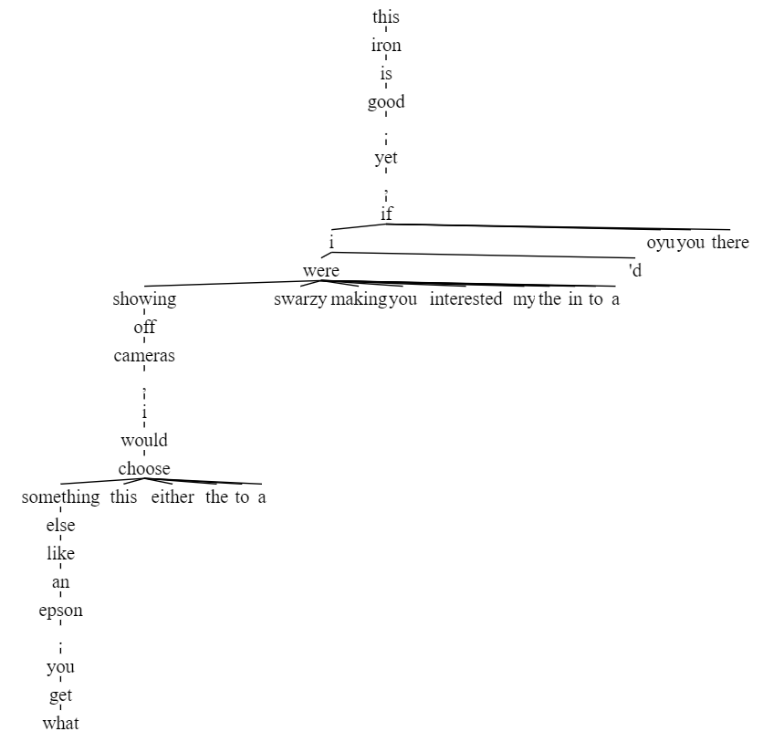

### Добро пожаловать в ветку участника LeonidMurashov :)

## Подходы к решению задачи:
1. Н-граммная модель (бейзлайн)
2. Генерация отзыва как задача машинного перевода:
	* на входе заголовок игры + заголовок отзыва
	* на входе заголовок отзыва и каждое третье предложение отзыва

## Н-граммная модель
Н-граммная модель послужила замечательным бейзлайном, генерируя читабельные отзывы. Которые тем не менее не имели главной мысли и просто являлись набором слов как-то связанных между собой.  

Для интерпретации результатов был разработан алгоритм изображения деревьев всевозможных вариантов развития текста.  

*[Красивая версия ngram.ipynb](ngram-stuff/ngram.pdf)*  

Отзывы:  
>**this iron is good . yet** , if i were showing off cameras , i would choose something else like an epson . you get what  

Широкие деревья с множеством опций:  

>**good book . perfect story** ... : i am a graduate of the u.s.m.m.a. , engineer and major , u.s.army , ret . in england  
>**good book . perfect story** to open up discussion in the classroom . avoid this .   
>**good book . perfect story** ... : i thought it was a parody , i ca n't understand . and you ca n't go on  
>**good book . perfect story** ... : i deleted this after several chapters . the number of programmable options was nowhere near that of the  

[дерево отзыва 1](ngram-stuff/4_gram.svg)  
[дерево отзыва 2](ngram-stuff/4_gram2.svg)  

## Машинный перевод
Задачу генерации отзывов по короткому описанию можно свести к задаче машинного перевода. Используем модель и статьи [Effective Approaches to Attention-based Neural Machine Translation](https://arxiv.org/abs/1508.04025v5).  

В данном подходе с целью уменьшения пространства действий будем использовать отзывы из того же датасета, но из категории видео игры. В данных содержится название игры и заголовок отзыва (часто он содержит главную мысль отзыва). Используем их как входные данные.  

Примеры генерации:  
"reviewtitle" является разделителем названия игры и заголовка отзыва.

>Input: <start> turtle reviewtitle i hate it <end>
>Predicted translation: i have to say that the <unk> is <unk> . i have to say that the <unk> is <unk> . i have to say that the <unk> is <unk> . i have to say that the <unk> is <unk> . i have to say that the <unk> is <unk> . i have to say that the <unk> is <unk> . i have to say that the <unk> is <unk> . i have to say that the <unk> is <unk> . i have to say that the <unk> is <unk> . i have to say that the <unk> is <unk> .   

>Input: <start> game reviewtitle good game this is <end>
>Predicted translation: i bought this game for my son . he loves it . <end>   

Иногда модель выдаёт не лучший результат и не может остановиться. Имплементируем beam search.
Примеры генерации:  

>**turtle reviewtitle i hate it**  
>[['<start> . . . . . <end>', -1.679051399230957],  
> ['<start> i am very disappointed . <end>', -1.689155101776123],  
> ['<start> i was very disappointed . <end>', -1.6988743146260579],  
> ['<start> i love it . <end>', -1.7169036865234375],  
> ['<start> my son loves it . <end>', -1.7271722157796223],]  

>**game reviewtitle good game this is**  
>[['<start> i love this game . <end>', -1.162440299987793],  
> ['<start> this game is great . <end>', -1.3510438601175945],  
> ['<start> my son loves it . <end>', -1.3648900985717773],  
> ['<start> . <end>', -3.3083176612854004]]  

>**game of blocks reviewtitle awful**  
>[['<start> this game is awful . <end>', -1.4846069018046062],  
> ['<start> this game is terrible . <end>', -1.5105679829915364],  
> ['<start> i love this game . <end>', -1.5400606791178386],  
> ['<start> this game sucks . <end>', -1.5434709548950196],  
> ['<start> this game is horrible . <end>', -1.5518356959025066],]  

>**fly and jump game reviewtitle i am in love**  
>[['<start> i love this game . <end>', -1.1592001914978027],  
> ['<start> i love this game ! <end>', -1.4713856379191081],  
> ['<start> i love this product . <end>', -1.4784666697184246],  
> ['<start> this game is great . <end>', -1.499791145324707],  
> ['<start> i love this program . <end>', -1.5230175654093425]]  
